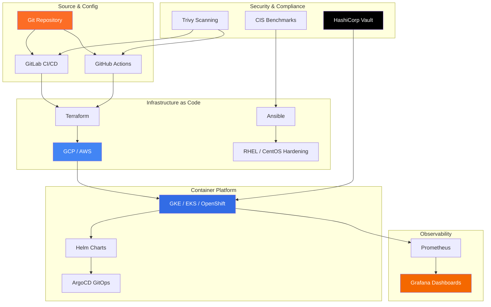

<div align="center">

# مرحباً - Hello, I'm Mohamed AbdelAziz 👋

**Senior DevOps & Cloud Architect | 12 Years Enterprise Infrastructure | MENA Region**

[](https://www.linkedin.com/in/maziz00/)
[](https://medium.com/@maziz00)
[](https://www.upwork.com/freelancers/maziz00)
[](https://devopsdispatch.beehiiv.com)

</div>

---

## 🚀 What I Do

I design, build, and automate **production-grade cloud infrastructure** for enterprises across the MENA region — from bare-metal data centers to cloud-native Kubernetes platforms.

12 years. Hundreds of pipelines. Dozens of migrations. Real war stories, documented.

```yaml
current_focus:
  - Building AI-powered DevOps tools with Claude Code
  - Creating open-source templates so engineers stop reinventing the wheel  
  - Writing about real-world DevOps in the MENA enterprise context
  - Freelance consulting: GCP · AWS · K8s · GitLab · IaC
```

---

## 🏗️ How I Build Infrastructure



---

## 🛠️ Tech Stack

<div align="center">

**Cloud & Infrastructure**


**CI/CD & GitOps**


**Security & Observability**


**OS & Systems**


</div>

---

## 📦 Open Source Templates

Production-grade DevOps templates built from 12 years of enterprise work.  
**Stop reinventing the wheel. Clone, configure, deploy.**

| Repository | Description | Stack |
|------------|-------------|-------|
| [🔧 gitlab-cicd-templates](https://github.com/maziz00/gitlab-cicd-templates) | 5 production-ready GitLab CI/CD pipeline templates | GitLab, Docker, Terraform, K8s |
| [☁️ terraform-modules](https://github.com/maziz00/terraform-modules) | Reusable Terraform modules for EKS, GKE, VPC | Terraform, AWS, GCP |
| [⚓ k8s-helm-charts](https://github.com/maziz00/k8s-helm-charts) | Helm charts for production Kubernetes deployments | Kubernetes, Helm, ArgoCD |
| [🔒 ansible-hardening](https://github.com/maziz00/ansible-hardening) | RHEL/CentOS security hardening playbooks (CIS benchmark) | Ansible, Red Hat |
| [🤖 devops-ai-copilot](https://github.com/maziz00/devops-ai-copilot) | AI-powered DevOps assistant — troubleshooting + pipeline generation | Python, FastAPI, Claude API |

---

## 📊 GitHub Stats

<div align="center">


</div>

---

## ✍️ Latest Articles on Medium

<!-- MEDIUM-ARTICLES-START -->
- [☁️ Cloud Migration Through a DevOps Lens: Triggers, Trade-Offs, and Strategy](https://medium.com/@maziz00/cloud-migration-through-a-devops-lens-a0bce7b4908a)
- [🤖 The Reality of Becoming a "10x DevOps Engineer" with AI](https://medium.com/@maziz00/the-reality-of-becoming-a-10x-devops-engineer-with-ai-773c674d8750)
- [🧩 When Automation Scales Wrong: Lessons from Pipelines That Outgrew Their Scripts](https://medium.com/@maziz00/when-automation-scales-wrong-0190e3bcd286)
- [🛠️ Why MTTR Defines the True Strength of Your DevOps Strategy](https://medium.com/@maziz00/why-mttr-defines-the-true-strength-of-your-devops-strategy-4857fe51ce50)
- [🚀 GitOps: The Operating System for Modern DevOps Excellence](https://medium.com/@maziz00/gitops-the-operating-system-for-modern-devops-excellence-d6b6f4b16730)

➡️ [Read all articles on Medium →](https://medium.com/@maziz00)
<!-- MEDIUM-ARTICLES-END -->

---

## 🌍 MENA Expertise — Why It Matters

Most DevOps resources are written for Silicon Valley. **I write and build for the reality of enterprise infrastructure in the UAE, Saudi Arabia, and Egypt:**

- 🏛️ Government & banking compliance (NESA, PDPL, NCA, MOD security)
- 🏢 Legacy data center → cloud migration in regulated environments
- 🌐 Multi-cloud governance in Arabic-speaking organizations
- 📋 Red Hat OpenShift + Kubernetes in air-gapped enterprise environments

---

## 📬 The DevOps Dispatch — Weekly Newsletter

Every week: **1 DevOps insight, 1 tool deep-dive, 1 war story, 1 job market tip.**  
Written for engineers who build and ship at scale in the real world — no hype, no fluff.

**📩 [Subscribe free → devopsdispatch.beehiiv.com](https://devopsdispatch.beehiiv.com)**  
*Free K8s Production Checklist when you subscribe.*

---

## 💼 Available for Consulting

**Specializations:**
- Cloud migration (on-prem → GCP/AWS)
- Kubernetes platform setup (EKS, GKE, OpenShift)
- GitLab CI/CD implementation & optimization
- DevSecOps pipeline integration
- Infrastructure as Code (Terraform + Ansible)
- MENA compliance automation

**[Book a consultation on Upwork →](https://www.upwork.com/freelancers/maziz00?s=1110580753140797440)**               **[Book 20 min call on Calendly →](https://calendly.com/maziz00/devops)**

---

<div align="center">

*"In the Middle East, we don't just deploy to the cloud — we navigate compliance, legacy systems, and organizational change simultaneously. That's the real DevOps challenge."*

** Mohamed AbdelAziz, Dubai UAE**


</div>
